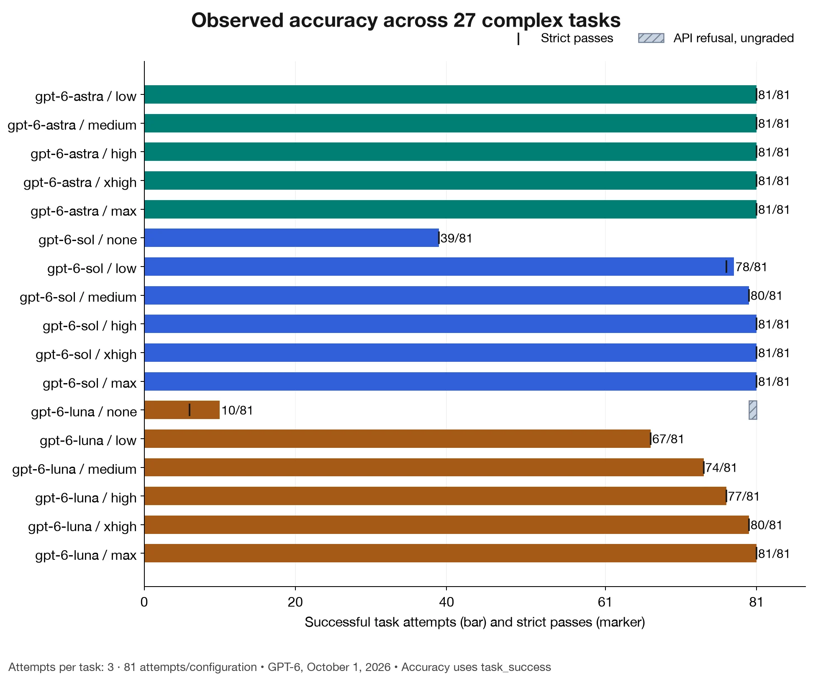
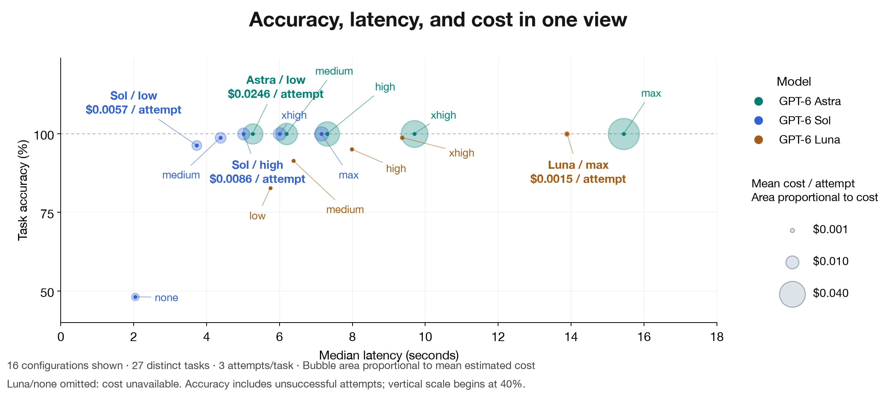
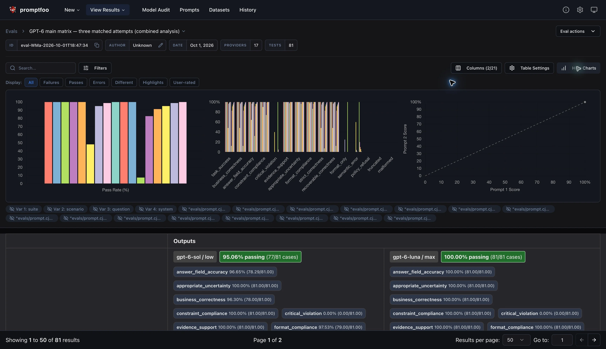

# OpenAI Reasoning Benchmark with Promptfoo

Compare correctness, reasoning tokens, latency and estimated cost across GPT-6 Astra/Sol/Luna. Promptfoo runs and records evaluations. Model choices and configurations are managed through environment variables and the `evals/models.json` catalog.

**The main eval contains 27 distinct complex reasoning tasks: nine domains × three different tasks each.** This distribution contains only the 27 tasks used in the post.

The nine domains are operations planning, procurement, liquidity, financial diligence, transformation, engagement delivery, incident response, disaster recovery, and release engineering. Enterprise, consulting, and technical are three profile views, each with nine tasks.

Each task provides a fictional evidence pack, explicit rules, and a checked answer contract. The main set includes constrained optimization, discrete-event simulation, minimax regret, financial reconciliation, causal-estimate interpretation, hypothesis diagnosis, distributed consistency, and safe state transitions. Task complexity reflects the supplied rules and reasoning mechanisms, rather than a guarantee of difficulty for every model.

See the [complete domain/question matrix and derivations](docs/UNIQUE_REASONING_BENCHMARK.md). The portable [27-row JSONL dataset](benchmarks/main/dataset.jsonl) includes messages, expected answers, domain, mechanism, and provenance. The [main manifest](evals/main-matrix.json) controls selection. Release: `complex-main-v4`.

## Example results

The charts below show the October 1, 2026 GPT-6 comparison: 27 distinct tasks, three attempts per task, and 81 attempts per configuration. Click any image to view it at full resolution.

### Observed accuracy

<a href="assets/figure-06.png">
  
</a>

Bars show task success; black markers show strict passes, including formatting requirements. The hatched segment identifies an ungraded API refusal.

### Accuracy, latency, and cost

<a href="assets/figure-09.png">
  
</a>

Bubble area represents mean estimated cost per attempt. Luna with no reasoning is omitted because cost is unavailable; the accuracy axis starts at 40%.

## Setup

Requires Node.js 22.22 or newer and Python 3.10 or newer. Python grading and reference solvers use the standard library; Node dependencies are pinned in `package-lock.json`.

```bash
npm ci
cp .env.example .env.local
# Edit .env.local and set OPENAI_API_KEY. Never commit this file.
npm test
npm run verify:answers
```

Plans and tests make no API calls. Live evaluations use your OpenAI API key and incur API charges. Model access depends on your account. The catalog and pricing snapshot are in `evals/models.json`; verify availability and current pricing before running a comparison.

## Run and inspect results

```bash
# Preview one complete family comparison without credentials or API calls.
BENCHMARK_FAMILY=gpt-6 npm run eval:matrix:plan

# Start with one configuration and one attempt on all 27 main tasks.
BENCHMARK_MODELS=gpt-6-sol BENCHMARK_EFFORT=low BENCHMARK_RUNS=1 \
  npm run eval -- --env-file .env.local

# All supported GPT-6 configurations, three attempts per task (1,377 calls).
BENCHMARK_FAMILY=gpt-6 npm run eval:matrix -- --env-file .env.local

# View stored results in Promptfoo and build a decision report.
npm run eval:view
npm run eval:report -- results/promptfoo-YOUR-RUN.json
```

Exports are written to `results/`; Promptfoo stores its local database in `.promptfoo/`. Both are ignored by Git. Explicit `--env-file` takes precedence over an inherited key and imports only `OPENAI_API_KEY` from that file.

<a href="assets/figure-05.png">
  
</a>

The Promptfoo viewer provides charts and per-case results for inspecting model outputs and grading metrics. Click the screenshot to view it at full resolution.

## Configure the matrix

### Choose models

[evals/models.json](evals/models.json) defines the available model catalog:

- `models`: allowed model IDs and each model's supported `efforts`.
- `defaultModels`: model IDs selected by `npm run eval` and `npm run eval:plan` when neither `BENCHMARK_MODELS` nor `BENCHMARK_FAMILY` is set. Edit this list to change those defaults; every ID must also exist in `models`.

**`eval:matrix` and `eval:matrix:plan` default to the `gpt-6` family, rather than `defaultModels`.** They select every catalog ID beginning with `gpt-6-`, use all supported efforts, and default to three attempts per task. Changing `defaultModels` alone does not change this family-based selection.

To choose models for a particular run, set `BENCHMARK_MODELS` to a comma-separated list of catalog IDs. Alternatively, use `BENCHMARK_FAMILY` (`gpt-6` or `gpt-5.6`) to select all catalog entries in that family. These two variables are mutually exclusive. `BENCHMARK_EFFORT` controls which supported reasoning efforts are included; unsupported model/effort pairs are skipped.

```bash
# Preview a matrix containing only Sol and Luna, without making API calls.
BENCHMARK_MODELS=gpt-6-sol,gpt-6-luna npm run eval:matrix:plan

# Run the same selection with three attempts per task and all supported efforts.
BENCHMARK_MODELS=gpt-6-sol,gpt-6-luna npm run eval:matrix -- --env-file .env.local

# Preview every GPT-5.6 model currently listed in the catalog.
BENCHMARK_FAMILY=gpt-5.6 npm run eval:matrix:plan
```

Keep the catalog as valid JSON; use selection variables to omit a model from a run. When adding a new model, also add its cost rates in [evals/pricing.cjs](evals/pricing.cjs). The catalog's `asOf` and `source` fields record metadata; they do not select models or automatically refresh the catalog.

### Matrix settings

The defaults in this table are for `eval`. The `eval:matrix` overrides are described above; selecting a family defaults to all supported efforts.

| Variable                      | Default                                     | Accepted values                                                      |
| ----------------------------- | ------------------------------------------- | -------------------------------------------------------------------- |
| `BENCHMARK_FAMILY`            | Unset (`gpt-6` for `eval:matrix`)           | `gpt-6` or `gpt-5.6`; mutually exclusive with `BENCHMARK_MODELS`     |
| `BENCHMARK_MODELS`            | GPT-6 Astra, Sol, Luna                      | Comma-separated IDs from `evals/models.json`                         |
| `BENCHMARK_EFFORT`            | `low,medium,high`                           | Any unique combination of `none,low,medium,high,xhigh,max`, or `all` |
| `BENCHMARK_PROFILE`           | `all`                                       | `all`, `broad_enterprise`, `consulting`, `technical`                 |
| `BENCHMARK_DOMAIN`            | All nine main domains                       | One or more domain IDs from the main manifest                        |
| `BENCHMARK_RUNS`              | `1`                                         | Integer from 1 to 100                                                |
| `BENCHMARK_CONCURRENCY`       | `1`                                         | Integer from 1 to 32                                                 |
| `BENCHMARK_VERBOSITY`         | `default`                                   | `default`, `low`, `medium`, `high`                                   |
| `BENCHMARK_MAX_OUTPUT_TOKENS` | 16,384 on decision; model default otherwise | Integer from 16 to 128000                                            |
| `BENCHMARK_ENV_FILE`          | Local credential selection                  | Path to an existing env file                                         |
| `PROMPTFOO_PYTHON`            | `python3`                                   | Python executable for solvers and assertions                         |

The output-token cap includes reasoning and visible output. Small caps can truncate an otherwise correct answer. Unsupported model/effort pairs are skipped and listed in the preview; an entirely unsupported selection fails before calls. `BENCHMARK_EFFORT=all` includes the `none` baseline and produces 17 compatible pairs for the default GPT-6 models, or **459 requests** across 27 distinct complex tasks. Selecting all four catalog models with all supported efforts produces 23 compatible pairs (621 requests per attempt across the 27 tasks). Use `BENCHMARK_MODELS` to select optional GPT-5.6 baselines; keep the model catalog as valid JSON rather than commenting out entries.

```bash
# Compare generations on financial analysis, with two fresh repetitions.
BENCHMARK_MODELS=gpt-6-sol,gpt-5.6-sol \
  npm run eval

# Test the non-reasoning baseline across compatible models.
BENCHMARK_EFFORT=none npm run eval

# Run one suite and tune generation controls.
BENCHMARK_MAX_OUTPUT_TOKENS=8192 npm run eval

# Native Promptfoo filters and additional exports are available after --.
```

The launcher's preview reports the matrix before native CLI filters. Promptfoo's final test count reflects those filters. Explicit native `--repeat` and `--max-concurrency` flags override the corresponding configuration values.

## Grading and failure interpretation

The primary pass condition is an exact, bare JSON answer with the required keys, types, array order, and values. Extra keys, prose, Markdown fences, malformed JSON, wrong values, integer fields spelled as decimals, and booleans used as numbers all fail. Decimal values are compared without floating-point tolerance.

Named metrics include `strict_correctness`, `recoverable_correctness`, `format_only`, and `semantic_error`. A correct answer inside a single JSON code fence increases recoverable correctness but still fails the strict contract. Refusals and truncated responses cannot pass. Endpoint errors remain Promptfoo errors rather than incorrect answers. The raw response and assertion reason help distinguish these cases. No structured-output enforcement is enabled: following the requested JSON format is part of the benchmark.

Each live launch first recomputes the selected suites' answer keys using their independent deterministic solvers. A mismatch stops the run before any model call.

## Accuracy gate

The report defaults to `--accuracy-gate per-case --min-accuracy 0.95`: at least 95% observed task success overall and for every selected prompt, zero critical violations, and complete comparable fresh coverage. With one or three attempts per task, this requires every attempt to succeed. This does not establish 95% production reliability. Choose the gate from your application requirements. For an overall-only gate, use:

```bash
npm run eval:report -- results/promptfoo-YOUR-RUN.json \
  --accuracy-gate overall --min-accuracy 0.95
```

## Project layout

- `assets/`: result charts and the Promptfoo dashboard screenshot.
- `benchmarks/`: source packs, answer keys, dataset builders, and reference solvers.
- `evals/`: Promptfoo configuration, model catalog, schemas, provider adapter, and graders.
- `scripts/`: command launcher, decision report, and portable dataset builder.
- `tests/`: offline harness, grading, and reference-answer checks.
- `docs/`: task specification, task specification.

The provider uses Promptfoo's native OpenAI Responses transport, strict OpenAI Structured Outputs, and final-answer selection before deterministic grading. Output contracts define structure and input identifiers; solved answers stay outside model-visible prompts and schemas.

## Troubleshooting

If no providers match, check the model IDs and supported reasoning efforts in `evals/models.json`. If the CLI cannot find Python, set `PROMPTFOO_PYTHON` to your Python executable. If credentials fail, verify the selected env file or shell key. A schema-valid response can still fail business correctness, ordering, numerical tolerance, evidence, or critical constraints; inspect the separate scores in Promptfoo rather than treating every failure as a transport error.

## License

MIT. See [LICENSE](LICENSE).
